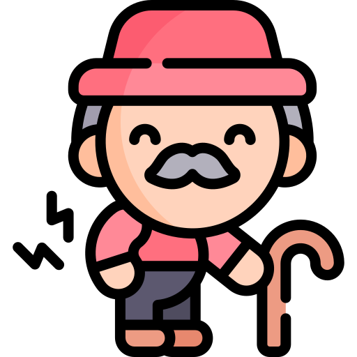

[![Contributors][contributors-shield]][contributors-url]
[![Forks][forks-shield]][forks-url]
[![Stargazers][stars-shield]][stars-url]
[![Issues][issues-shield]][issues-url]

<!-- PROJECT LOGO -->
 

  

<h3 align="center">ActiveBrain</h3>

  

    An interactive and efficient project, which is used to perform a mini-mental test. The mini-mental test is a test used to assess cognitive impairment and dementia.
     
    <a href="https://github.com/josecarlosmemo/activeBrain"><strong>Explore the docs »</strong></a>
     
     
    <a href="https://activebrain.jcmn.me">View Demo</a>
    ·
    <a href="https://github.com/josecarlosmemo/activeBrain/issues">Report Bug</a>
    ·
    <a href="https://github.com/josecarlosmemo/activeBrain/issues">Request Feature</a>
  

<!-- TABLE OF CONTENTS -->

  
Table of Contents

  <ol>
    <li>
      <a href="#about-the-project">About The Project</a>
      <ul>
        <li><a href="#built-with">Built With</a></li>
      </ul>
    </li>
    <li><a href="#contributing">Contributing</a></li>
    <!-- <li><a href="#contact">Contact</a></li> -->

  </ol>

<!-- ABOUT THE PROJECT -->

## About The Project

[![ActiveBrain Screen Shot][project_screenshot]](https://activebrain.jcmn.me)

For this project, our team focused on finding a more interactive and efficient way to perform the mini-mental tests, which help geriatricians to measure the physical and mental performance of the elderly. To achieve this, we created an app, which keeps track of each patient's test results, and also in which the tests can be performed. Also the doctor or patient's administrator will be able to see a list and calendar where they can view patients and see their performance.

(<a href="#top">back to top</a>)

### Built With

(<a href="#top">back to top</a>)

<!-- CONTRIBUTING -->

## Contributing

Contributions are what make the open source community such an amazing place to learn, inspire, and create. Any contributions you make are **greatly appreciated**.

If you have a suggestion that would make this better, please fork the repo and create a pull request. You can also simply open an issue with the tag "enhancement".
Don't forget to give the project a star! Thanks again!

1. Fork the Project
2. Create your Feature Branch (`git checkout -b feature/AmazingFeature`)
3. Commit your Changes (`git commit -m 'Add some AmazingFeature'`)
4. Push to the Branch (`git push origin feature/AmazingFeature`)
5. Open a Pull Request

(<a href="#top">back to top</a>)

[contributors-shield]: https://img.shields.io/github/contributors/josecarlosmemo/activeBrain.svg?style=for-the-badge
[contributors-url]: https://github.com/josecarlosmemo/activeBrain/graphs/contributors
[forks-shield]: https://img.shields.io/github/forks/josecarlosmemo/activeBrain.svg?style=for-the-badge
[forks-url]: https://github.com/josecarlosmemo/activeBrain/network/members
[stars-shield]: https://img.shields.io/github/stars/josecarlosmemo/activeBrain.svg?style=for-the-badge
[stars-url]: https://github.com/josecarlosmemo/activeBrain/stargazers
[issues-shield]: https://img.shields.io/github/issues/josecarlosmemo/activeBrain.svg?style=for-the-badge
[issues-url]: https://github.com/josecarlosmemo/activeBrain/issues
[project_screenshot]: ./images/activebrain_screenshot.png
